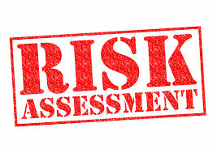

<!--
  * browser: key-performance-indicator
  * tracker: 88d18445ffe6fd1b1583aac35374c920
  * version: 1.0.0
  * updated: 2019-02-22
  * contact: Joel Parker Henderson (http://joelparkerhenderson.com)
  * options: commentable
-->

# Key Risk Indicator (KRI)

A key risk indicator (KRI) is a measure used in management to indicate how risky an activity is. This page is summary excerpts from [Wikipedia / Key risk indicator](https://en.wikipedia.org/wiki/Key_risk_indicator).

Contents:

* [What is a KRI?](#what-is-a-kri)
* [What is the best KRI?](#what-is-the-best-kri)
* [How can a KRI help?](#how-can-a-kri-help)
* [What makes a good KRI?](#what-makes-a-good-kri)
* [How to handle KRI?](#how-to-handle-kri)
* [Links](#links)

## What is a KRI?

A key risk indicator (KRI) is a measure used in management to indicate how risky an activity is. 

Key risk indicators are metrics used by organizations to provide an early signal of increasing risk exposures in various areas of the enterprise. It differs from a key performance indicator (KPI) in that the latter is meant as a measure of how well something is being done while the former is an indicator of the possibility of future adverse impact. 

KRI give an early warning to identify potential event that may harm continuity of the activity/project.

KRIs are a mainstay of operational risk analysis.

## What is the best KRI?

Organizations have different sizes and environment. 

So every enterprise should choose its own KRI, taking into account the following steps:

  * Consider the different stakeholders of the organization

  * Make a balanced selection of risk indicators, covering performance indicators, lead indicators and trends

  * Ensure that the selected indicators drill down to the root cause of the events

  * Choose high relevant and high probability of predicting important risks: high business impact, easy to measure, high correlation with the risk, and sensitivity.
 
  * Determine thresholds and triggers for the set of KRI's

  * Locate and fold in data sources that contribute or feed data into KRI triggers

  * Determine notification methods, recipients, and action or response sequences

## How can a KRI help?

The constant measure of KRI can bring the following benefits to the organization:

  * Provide an early warning: a proactive action can take place

  * Provide a backward looking view on risk events, so lesson can be learned by the past

  * Provide an indication that the risk appetite and tolerance are reached

  * Provide real time actionable intelligence to decision makers and risk managers

## What makes a good KRI?

Qualities of good key risk indicators:

  * Ability to measure the right thing (e.g., supports the decisions that need to be made)

  * Quantifiable (e.g., damages in dollars of profit loss)

  * Capability to be measured precisely and accurately

  * Ability to be validated against ground truth, and confidence level one has in the assertions made within the framework of the metric

## How to handle KRI?

Management selects a risk response strategy for specific risks identified and analyzed, which may include:

  * Avoidance: exiting the activities giving rise to risk

  * Reduction: taking action to reduce the likelihood or impact related to the risk

  * Alternative Actions: deciding and considering other feasible steps to minimize risks

  * Share or Insure: transferring or sharing a portion of the risk, to finance it

  * Accept: no action is taken, due to a cost/benefit decision

Monitoring is typically performed by management as part of its internal control activities, such as review of analytical reports or management committee meetings with relevant experts, to understand how the risk response strategy is working and whether the objectives are being achieved.

## Links

Wikipedia:

  * [Risk management](https://en.wikipedia.org/wiki/Risk_management)

  * [Enterpriserisk management](https://en.wikipedia.org/wiki/Enterprise_risk_management)
